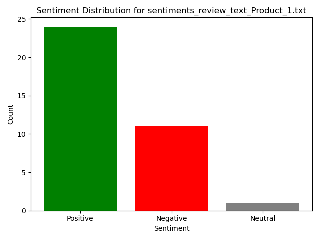

# **Project 3: Sentiment Analysis Pipeline**

## **Overview**

This project combines scraped review files (from Project 2) with a sentiment analysis pipeline (from Project 1). The pipeline processes product reviews, classifies sentiments as **positive**, **negative**, or **neutral**, and saves the results to text files. The sentiment counts are visualized with Matplotlib for each product.

This project focuses on modularity, code organization, and ease of use while integrating two previous projects. The pipeline is designed with object-oriented programming (OOP) principles, and the sentiment classification is powered by a pre-trained model (`distilbert-base-uncased-finetuned-sst-2-english`).

---

## **Features**

- **Sentiment Analysis**: Classifies comments into positive, negative, or neutral using a pre-trained NLP model.
- **Preprocessing**: Cleans and standardizes review text for better accuracy.
- **Output Files**: Generates a separate sentiment file for each input review file.
- **Visualization**: Creates bar charts for sentiment counts of each product using Matplotlib.
- **Modularity**: Incorporates OOP principles for better code reusability and testing.

---

## **File Structure**

```plaintext
Project3/
├── project3_main.py         # Main pipeline to process reviews and plot results
├── sentiment_analyzer.py    # Module for sentiment classification using Hugging Face
├── requirements.yml         # Conda environment dependencies
├── output/                  # Directory for output sentiment files
└── README.md                # Detailed project documentation

```

## **Requirements**

This project uses Python and the Conda package manager. The dependencies are specified in the `requirements.yml` file.

### **Steps to Install**
1. Install Miniconda or Anaconda: [Conda Installation Guide](https://docs.conda.io/en/latest/miniconda.html).
2. Create the Conda environment:
   ```bash
   conda env create -f requirements.yml
   ```
3. Activate the environment:
   ```bash
   conda activate sentiment_pipeline
   ```

---

## **Usage**

### **1. Input Files**
- Place the review text files (e.g., `review_text_Product_X.txt`) in the `../Project2/` directory.
- Each review file should follow this format:
  ```plaintext
  Title: Fastest shipping on scene on eBay so far kudos to the owner...
  Comment: Fastest shipping on scene on eBay so far kudos to the owner...

  Title: The headset is filthy. Sticky residue and blemishes all over...
  Comment: The headset is filthy. Sticky residue and blemishes all over...
  ```

### **2. Running the Pipeline**
Run the main script:
```bash
python project3_main.py
```

### **3. Outputs**
- **Sentiment Results**: Saved as `sentiments_<input_filename>.txt` in the `./output/` directory.
- **Visualization**: Sentiment counts are displayed as bar charts using Matplotlib.

---

## **Sample Output**

### **1. Sentiment File**
For an input file `review_text_Product_1.txt`:
```plaintext
positive
negative
neutral
positive
```

### **2. Bar Chart**


---

## **Code Details**

### **1. Preprocessing**
The `preprocess_comment` function standardizes review text by:
- Removing trailing phrases (e.g., `"Read full review..."`).
- Cleaning unnecessary spaces and repetitive punctuation.
- Truncating overly long reviews to 512 characters.

### **2. Sentiment Classification**
The `SentimentAnalyzer` class uses the Hugging Face model `distilbert-base-uncased-finetuned-sst-2-english` to classify reviews as:
- **Positive**: High confidence in a positive review.
- **Negative**: High confidence in a negative review.
- **Neutral**: Low confidence in both positive and negative sentiments.

### **3. Modular Pipeline**
The `SentimentPipeline` class:
- Processes all review files in the `../Project2/` directory.
- Calls the `SentimentAnalyzer` for each review.
- Saves the results and plots sentiment counts.

---

## **Testing**

Test cases are included to validate the functionality of individual components using `pytest`.

### **Running Tests**
Run the test suite:
```bash
pytest test_sentiment_analysis.py
```

### **Sample Test Cases**
- **Test Sentiment Classification**:
  - Ensure positive comments are classified as `positive`.
  - Ensure negative comments are classified as `negative`.
  - Handle ambiguous or mixed comments as `neutral`.
- **Test Preprocessing**:
  - Verify cleaning and truncation of input text.

---

## **Known Limitations**

1. **Neutral Sentiment**:
   - Neutral classifications depend on a confidence threshold and may need fine-tuning for ambiguous comments.
2. **Model Limitations**:
   - The sentiment analysis relies on a pre-trained model (`distilbert-base-uncased-finetuned-sst-2-english`) that may misclassify complex reviews.

---

## **Future Improvements**

1. **Fine-Tuning**:
   - Train a custom model with a dataset including neutral sentiment.
2. **Advanced Preprocessing**:
   - Incorporate more sophisticated text-cleaning methods to improve accuracy.


